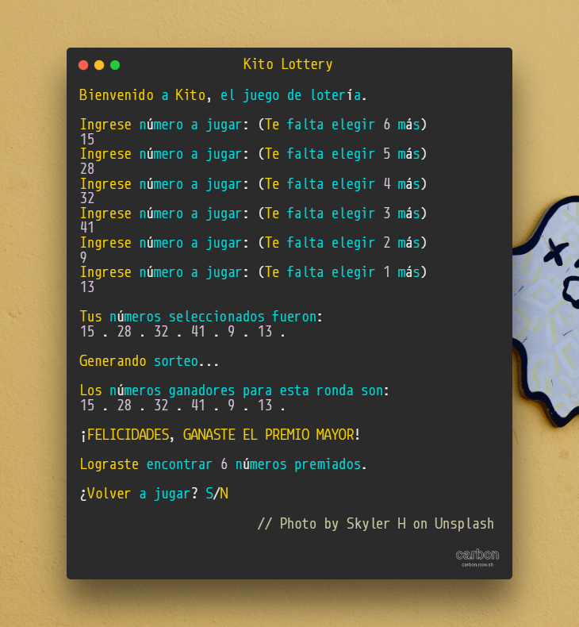

# Kito Lottery :slot_machine:

  

  Boceto inicial de un simulador de un juego de lotería genérico.

## ¿Qué es _Kito Lottery_?

¿Cuántas veces has creido que estabas muy cerca de ganar la lotería? ¡Pues jamás estuviste ni a un pelo de ganar! Con este boceto de un simulador de un billete de lotería podrás jugar una y otra vez tus números tan preciados.

## ¿Qué tan difícil es ganar la lotería real?
En el caso de jugar _un Loto_, la probabilidad de ganar el pozo es de **1 entre 4.496.388**. Las reglas dicen que para ganar debes comprar un billete/boleto del _Loto_ y acertar los 6 números de los 41 posibles.

## Referencias
- [Posibilidad de ganar la lotería](https://www.thelotter.cl/probabilidad-ganar-loto)
- [Números factoriales en Python3](https://www.geeksforgeeks.org/python-math-factorial-function/)
- [Sets e intersecciones en Python3](https://www.w3schools.com/python/ref_set_intersection.asp)
- [Screenshot/Captura de pantalla/Pantallazo del código](https://carbon.now.sh/)
- Fotografía de fondo en Unsplash, por Skyler H
- [Compresor de imágenes](https://compresspng.com/es/)
- [Emojis para el _Readme_ de Github](https://github.com/ikatyang/emoji-cheat-sheet/blob/master/README.md)